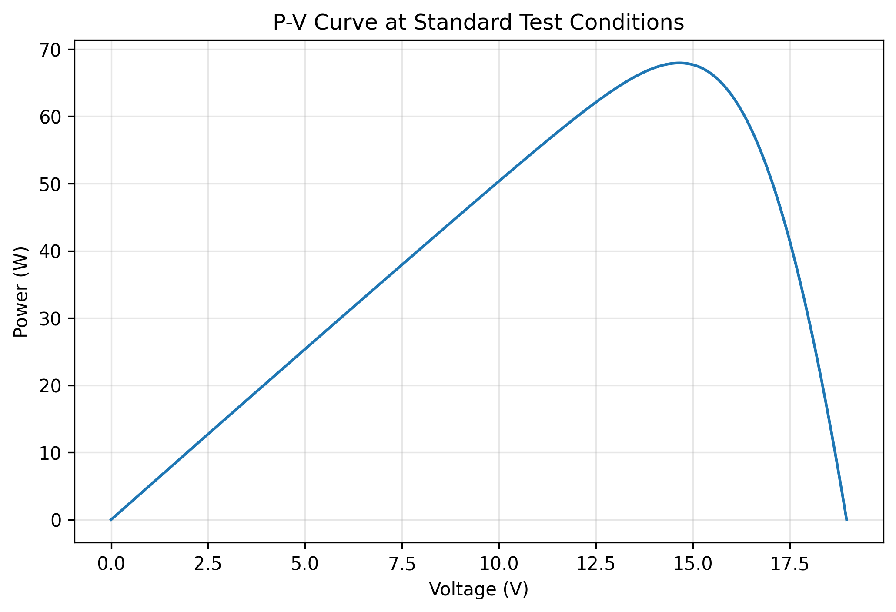
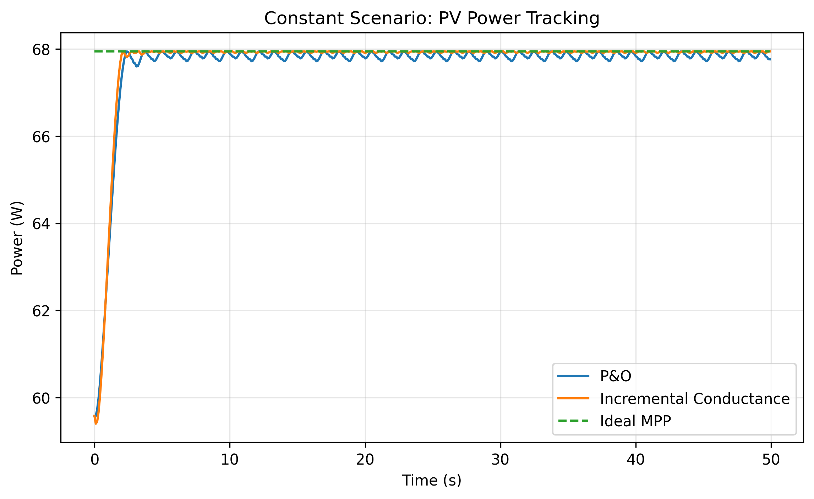

# Solar PV MPPT Simulation in Python

A research-oriented photovoltaic Maximum Power Point Tracking (MPPT) simulation built in Python using `pvlib`, `NumPy`, `SciPy`, `Pandas`, and `Matplotlib`.

This project compares the performance of the classic **Perturb & Observe (P&O)** algorithm and the advanced **Incremental Conductance (IncCond)** technique under dynamic environmental profiles, utilizing a verified diode PV model paired with an averaged DC-DC boost converter power electronics stage.

---

## 🎯 Project Goal

The primary objective of this framework is to model, simulate, and analyze the tracking behaviors, transition speeds, and steady-state efficiencies of solar MPPT control algorithms as they adapt to erratic atmospheric conditions.

---

## ✨ Features

- **High-Fidelity PV Modeling:** Standard single-diode evaluation using industry-standard `pvlib` profiles.
- **Averaged Power Electronics Plant:** Clean mathematical state-space representation of a DC-DC Boost Converter.
- **Dual Algorithmic Controllers:** Full functional modules for both Perturb & Observe and Incremental Conductance.
- **Dynamic Test Benches:** Evaluation scenarios including constant irradiance, sudden step changes, and continuous ramp profiles.
- **Automated Analytics:** Instant calculation of tracking efficiencies, power generation curves, and data-logging generation.

---

## 🧮 MPPT Control Topologies

### 1. Perturb & Observe (P&O)
An iterative control feedback mechanism that introduces step perturbations to the operating duty cycle and monitors the delta change in power output to determine subsequent stepping directions.

### 2. Incremental Conductance
A deterministic control architecture operating on the principle that the slope of the PV module power curve is zero at the Maximum Power Point (MPP):

$$\frac{dP}{dV} = 0$$

By evaluating the relationship between incremental conductance ($\Delta I / \Delta V$) and instantaneous conductance ($I / V$), the controller dynamically tracks the peak without continuous steady-state hunting losses.

---

## 💻 Tech Stack

- **Language:** Python 3
- **Solar Modeling:** `pvlib`
- **Data Engineering:** `NumPy`, `SciPy`, `Pandas`
- **Visualization:** `Matplotlib`
- **IDE:** Visual Studio Code

---

## 📁 Repository Structure

```text
mppt_project/
│
├── src/
│   ├── pv_model.py
│   ├── boost_converter.py
│   ├── mppt_po.py
│   ├── mppt_inccond.py
│   ├── simulate.py
│   └── plots.py
│
├── results/
│   ├── figures/
│   ├── data/
│   └── summary_table.csv
│
├── docs/
│   └── summary.md
│
├── requirements.txt
└── README.md
```

---

## ⚙️ Installation & Setup

### 1. Setup Your Workspace Directory
Ensure the repository files are correctly placed within your active local workspace directory.

### 2. Initialize a Virtual Environment
```bash
python -m venv .venv
```

### 3. Activate the Environment
- **Windows (Git Bash / PowerShell):**
  ```bash
  .venv/Scripts/activate
  ```
- **macOS / Linux:**
  ```bash
  source .venv/bin/activate
  ```

### 4. Install Dependencies
```bash
pip install -r requirements.txt
```

---

## 🚀 Execution Guide

Run the central simulation controller via your terminal window:
```bash
python src/simulate.py
```
Upon a successful execution run, the mathematical solvers will automatically populate your analytical charts, log sheets, and summary documents directly into the `results/` and `docs/` paths.

---

## 📊 Simulation Results & Visualizations

### 1. Solar PV Characteristics at STC
The system successfully identifies the theoretical tracking ceiling under Standard Test Conditions (1000 W/m², 25°C), placing the target operational point at $V \approx 14.65\text{V}$ and $P \approx 67.9\text{W}$:


### 2. Dynamic Performance Comparison
The real-time tracking response showcases the characteristic steady-state power oscillations of the Perturb & Observe (P&O) routine alongside the clean, stabilized convergence path calculated by the active Incremental Conductance engine:


---

## 🔧 Engineering Journal & Debugging Notes

During the development of this simulation framework, two critical technical roadblocks were isolated and resolved:

1. **Incremental Conductance Stagnation:** The IC tracking path initially flatlined due to rigid floating-point equality constraints ($\frac{dI}{dV} + \frac{I}{V} = 0$). In pure digital simulation domains, continuous floating-point values rarely match an absolute mathematical zero. This was bypassed by configuring an absolute convergence tolerance threshold ($\epsilon = 0.001$), matching authentic controller behaviors.
2. **Data Frame Reference Mapping:** The visualization module encountered a fatal runtime crash trying to extract `v_mp_ideal` from an active time-series dataframe index. The plotting architecture was refactored to treat the ideal maximum target voltage as a static reference matrix derived directly from background environmental scenarios, stabilizing data generation.

---

## 🔮 Future Enhancements

- Integrate high-frequency switching frequency models (PWM) for the boost converter stage.
- Explore global optimization tracking under extreme partial shading conditions using Particle Swarm Optimization (PSO).
- Implement hardware-in-the-loop (HIL) code validation.

---

## 🧑‍💻 Author

- **Suyash Srivastava**
- Electrical Engineering Student
- [GitHub Profile](https://github.com/suyashsrivastava-ee)
- [LinkedIn Profile](https://www.linkedin.com/in/suyash-srivastava-1a34103ab)

---

## 📄 License

Copyright (c) 2026 Suyash Srivastava

Permission is hereby granted, free of charge, to any person obtaining a copy of this software and associated documentation files (the "Software"), to deal in the Software without restriction, including without limitation the rights to use, copy, modify, merge, publish, distribute, sublicense, and/or sell copies of the Software, and to permit persons to whom the Software is furnished to do so, subject to the following conditions:

The above copyright notice and this permission notice shall be included in all copies or substantial portions of the Software.

THE SOFTWARE IS PROVIDED "AS IS", WITHOUT WARRANTY OF ANY KIND, EXPRESS OR IMPLIED, INCLUDING BUT NOT LIMITED TO THE WARRANTIES OF MERCHANTABILITY, FITNESS FOR A PARTICULAR PURPOSE AND NONINFRINGEMENT. IN NO EVENT SHALL THE AUTHORS OR COPYRIGHT HOLDERS BE LIABLE FOR ANY CLAIM, DAMAGES OR OTHER LIABILITY, WHETHER IN AN ACTION OF CONTRACT, TORT OR OTHERWISE, ARISING FROM, OUT OF OR IN CONNECTION WITH THE SOFTWARE OR THE USE OR OTHER DEALINGS IN THE SOFTWARE.